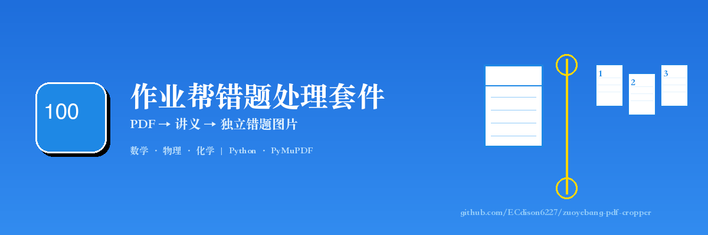
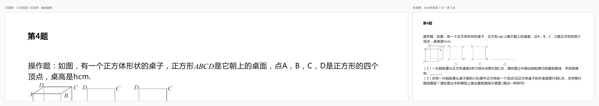
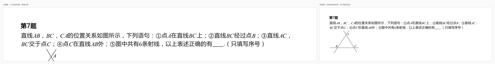
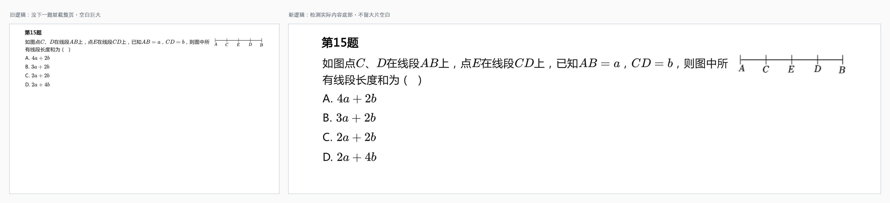

<p align="center">
  两个 Python skill：处理作业帮错题本 PDF → 生成讲义 → 切分为独立错题图片
</p>

<p align="center">
  <a href="https://note.edsionc.top">📚 知识点笔记</a> ·
  <a href="#快速开始">🚀 快速开始</a> ·
  <a href="#完整案例">📖 完整案例</a> ·
  <a href="README.en.md">English</a>
</p>

---

## 前言：为什么写这两个 skill

我做小班线上补课，小学、初中的数学、物理、化学，偶尔也会接英语，A level 和 IB 也在做。班小，每个学生错的题不一样，我不想让所有人都刷同一份卷子——会做的题重复做很浪费时间。

我习惯把题分成三类：

- **一类题**：看了教辅知识点就能做。
- **二类题**：看了教辅后，给足够时间能想出来。
- **三类题**：只有见过才会做，没见过基本做不出来（很多是大学知识下放）。

这两个 skill 就是服务于**三类题**的：把作业帮错题本导出的 PDF 先做成讲义，再把每道题单独切出来，按学生拼接成每个人专属的错题本。不会的题反复练，会的题不再重复刷。

目前学科知识点识别主要覆盖 **数学、物理、化学**。英语识别逻辑写了但还没实测，A level 和 IB 因为太小众暂时没有放出来。（小众赛道的朋友可以直接发邮件交流，邮箱在文末。）

## 两个 Skill 的定位

这个仓库是**两个 skill 的包**，互相独立，也可以串起来用：

| # | Skill | 作用 | 输入 | 输出 |
|---|-------|------|------|------|
| 1 | [mistake-notebook-processor](skills/mistake-notebook-processor/) | 处理作业帮 PDF：去品牌、加页眉页脚、生成带封面的讲义 | 作业帮错题本 PDF | 个性化讲义 PDF |
| 2 | [pdf-question-cropper](skills/pdf-question-cropper/) | 按题号把讲义切成独立图片 | 讲义 PDF | 每道题的 PNG + 裁剪报告 |

### 推荐工作流

```
┌─────────────┐     ┌─────────────────────────────┐     ┌─────────────────┐
│ 作业帮 App  │ ──→ │  mistake-notebook-processor │ ──→ │  个性化讲义 PDF  │
│ 导出错题本  │     │  （首次自定义页眉页脚）      │     │                 │
└─────────────┘     └─────────────────────────────┘     └────────┬────────┘
                                                                 │
                                                                 ↓
┌─────────────┐     ┌─────────────────┐     ┌─────────────────────────┐
│ 每个学生拿到 │ ←── │  按学生拼接错题  │ ←── │   pdf-question-cropper  │
│ 专属错题本  │     │  （只练不会的）  │     │   切成独立题目图片       │
└─────────────┘     └─────────────────┘     └─────────────────────────┘
```

> 不会用？直接把本仓库地址 `https://github.com/ECdison6227/zuoyebang-pdf-cropper` 丢给 AI，让它帮你装环境、改配置、跑起来。

### 关于页眉页脚

第一次使用 **mistake-notebook-processor** 时，建议先打开 `process_mistake.py` 修改一次页眉、页脚和提示语，改成你自己的信息（比如你的知识点站点、联系方式）。修改一次后，后续每次调用这个 skill 都会沿用这套配置。

## 能做什么 / 不能做什么

### 能做什么

| 场景 | 效果 |
|------|------|
| 作业帮单列导出的错题本 PDF | 自动去掉顶部 logo 和底部页码 |
| 已处理过的作业帮讲义 | 自动去掉页眉页脚，识别题型 |
| 跨页题目 | 自动把跨页题拼成一道完整的题 |
| 底部带图的题目 | 接近页底时保守截取，不把图切掉 |
| 最后一题 | 截到实际内容底部，不会截整页空白 |
| 知识点识别 | 自动识别数学/物理/化学/生物等学科知识点，写入讲义封面 |
| 个性化讲义 | 自动生成封面（注意要点、知识点、掌握情况打勾表）+ 页眉提示页脚 |

### 不能做什么

- **必须是从作业帮单列导出的错题本 PDF**。切分 skill 的题号正则和品牌区域是按作业帮格式硬编码的，其他题库的 PDF 不会切分（但讲义生成 skill 仍可识别知识点并生成封面）。
- **扫描版 PDF 不支持**：纯图片无文字层的 PDF 识别不了题号，需要自己加 OCR。
- **手写题不支持**：只处理印刷体题号。
- **非单列排版不支持**：不处理多栏或密集答题卡排版。
- **英语、A level、IB**：英语已写识别逻辑但未实测；A level 和 IB 暂未放出。

## 快速开始

### 环境准备

```bash
pip install pymupdf Pillow
```

### Skill 1：mistake-notebook-processor（生成讲义）

第一次使用前，先修改 `skills/mistake-notebook-processor/process_mistake.py` 里的页眉页脚信息：

```python
# 示例默认值
ftr = "edsionc.top  |  2014184720@qq.com"  # 改成你的站点和联系方式
```

也可以改 `SUBJECT_RULES` 和 `SUBJECT_TIPS` 里的提示语。

然后运行：

```bash
cd skills/mistake-notebook-processor
python3 process_mistake.py 你的错题本.pdf
```

会在同目录生成 `数学讲义-20260617.pdf`（学科和日期自动从文件名解析）。

### Skill 2：pdf-question-cropper（切分题目）

```bash
cd skills/pdf-question-cropper
python3 crop_questions.py 讲义.pdf
```

不指定输出目录时，会在当前目录生成 `<PDF名>_题目图片/`：

```
讲义_题目图片/
├── 题目_01.png
├── 题目_02.png
├── ...
└── 裁剪报告.txt
```

### 不想用 skill，直接用代码？

可以。每个 skill 目录下都有独立的 Python 脚本，直接 `python3 xxx.py` 就能跑。但建议用 skill 的方式调用，因为 skill 里包含了完整的触发条件、配置说明和踩坑记录。

## 标准 Prompt

如果你想让 AI 调用这两个 skill，可以用下面的 prompt：

### 生成讲义

> 请用 mistake-notebook-processor skill 处理这份作业帮错题本 PDF：
> - 去掉顶部 logo 和底部页码
> - 生成带封面的讲义，封面包含：整理日期、注意要点、本次知识点、题目掌握情况打勾表
> - 页眉格式：日期 | 知识点 | 学科；页脚放我的站点 edsionc.top
> - 输出文件名为：学科讲义-日期.pdf

### 切分题目

> 请用 pdf-question-cropper skill 把这份讲义 PDF 按题号切成独立图片：
> - 自动识别并跳过封面页
> - 跨页题目要自动合并
> - 底部带图的题不要把图切掉
> - 最后一题只截到实际内容底部
> - 输出每道题的 PNG 和裁剪报告

## 完整案例：一份 6 页 15 题的数学讲义

输入文件：[examples/输入/数学讲义-20260616.pdf](examples/输入/数学讲义-20260616.pdf)

这是一份已经处理过的讲义：第 1 页是封面，第 2-6 页是 15 道数学题。

先生成讲义，再切分：

```bash
# 生成讲义（如果用 process_mistake.py 处理原始作业帮 PDF）
python3 skills/mistake-notebook-processor/process_mistake.py examples/输入/数学讲义-20260616.pdf

# 切分题目
python3 skills/pdf-question-cropper/crop_questions.py examples/输入/数学讲义-20260616.pdf examples/输出
```

输出 15 张独立题目图片 + 裁剪报告：

```
源PDF文件: 数学讲义-20260616.pdf
PDF类型: 已处理讲义
学科: 数学
总页数: 6
跳过封面页: [1]
裁剪题目总数: 15
识别知识点: 立体几何、角、线段、正方形

  题目_01.png - 第2页 [第1题]
  题目_02.png - 第2页 [第2题]
  题目_03.png - 第2页 [第3题]
  题目_04.png - 第2页 [第4题] (跨页合并: 第2页-第3页)
  ...
  题目_15.png - 第6页 [第15题]
```

### 三个容易切错的点

#### 1. 跨页题目：第 4 题

全局排序所有题号，看下一页第一个题号离页眉有多远。贴在页顶 → 新题；离页顶很远 → 上一题的续页。



#### 2. 底部带图：第 7 题

当文本底部离页底很近时，宁可多截一点，把页底也包含进来，避免图被切掉。



#### 3. 最后一题：第 15 题

扫描文本 spans 找实际内容最底部，只在那下面留 30px 空白。



## 工作原理

### Skill 1：mistake-notebook-processor

1. **读取全文**：扫描所有页面文本，正则匹配知识点字典。
2. **创建封面**：生成封面页，包含学科标题、整理日期、注意要点、知识点列表、题目掌握情况打勾表。
3. **正文去品牌**：用 `redaction` 物理删除顶部 logo（y=0~68）和底部页码（y=795~842）。
4. **叠加页眉页脚**：居中绘制页眉（日期|知识点|学科）、提示行、页脚。
5. **合并输出**：封面在前，正文在后，保存为 `学科讲义-日期.pdf`。

### Skill 2：pdf-question-cropper

1. **检测 PDF 类型**：区分原始作业帮 PDF、已处理讲义、通用 PDF。
2. **找题号**：用 `get_text("dict")` 的 line/span 级别提取文本，合并同行 span 后匹配题目序号。
3. **全局排序**：所有非封面页题号按 `(page_index, y)` 排序。
4. **跨页判断**：下一页首个题号离页眉距离 >= 80px 视为当前题续页，执行部分页拼接。
5. **内容边界保护**：不跨页且同页无下一题的题，扫描文本找实际内容底部；若接近页底（<120px），保守截到页底。
6. **切分输出**：按题号裁剪页面区域，跨页题垂直拼接。

## 关键配置

如需适配其他题库，可修改 `crop_questions.py` 里的常量：

| 常量 | 默认值 | 说明 |
|------|--------|------|
| `ZYB_TOP_BRAND` | 68 | 原始作业帮 PDF 顶部 logo 高度 |
| `ZYB_BOTTOM_FOOTER` | 47 | 原始作业帮 PDF 底部页码高度 |
| `PROCESSED_HEADER` | 68 | 已处理讲义页眉高度 |
| `PROCESSED_FOOTER` | 33 | 已处理讲义页脚高度 |
| `CROSS_PAGE_THRESHOLD` | 80 | 跨页判断阈值 |
| `BOTTOM_MARGIN_THRESHOLD` | 120 | 内容底部接近页底阈值 |

## 踩坑记录

- **文本块粒度**：早期用 `get_text("blocks")` 导致"第 1 题"和正文被拆成两块，15 题切出 30 张图。改用 `get_text("dict")` 解决。
- **小问序号误识别**：`(1)`、`①` 被当成新题。加了 `SUBQUESTION_PATTERN` 排除。
- **封面页误切**：封面"掌握情况"里的"第 X 题"被当成题号。加了 `COVER_PATTERN` 跳过。
- **跨页判断错误**：第 7、14 题被误拼下一页。改成全局题号序列 + 距离阈值判断。
- **底部图片被切**：第 7 题图只剩一半。增加"接近页底保守截"逻辑。

## 关联资源

- **[Note.edsionc.top](https://note.edsionc.top)**：我的知识点笔记站点，讲义里识别到的知识点对应到这里。切出来的错题图片后续也会整理进去。

## 交流与合作

如果你也在做小班教学、错题本整理，欢迎参考这个仓库。

我们的工作室目前招收小学、初中 **数学、物理、化学、英语** 学生，也做 **A level 和 IB** 课程。A level 和 IB 的内容比较小众，暂时没有开源出来，但有需求可以联系我交流。

📮 邮箱：**2014184720@qq.com**

## 限制与后续

- 主要针对 A4 页面调试，其他尺寸需要改裁剪区域。
- 多栏排版 PDF 尚未处理。
- 切分 skill 只支持作业帮导出的 PDF；讲义生成 skill 对非作业帮 PDF 仍可识别知识点。
- 英语识别逻辑已写但未实测，后续会补案例。

## License

MIT
